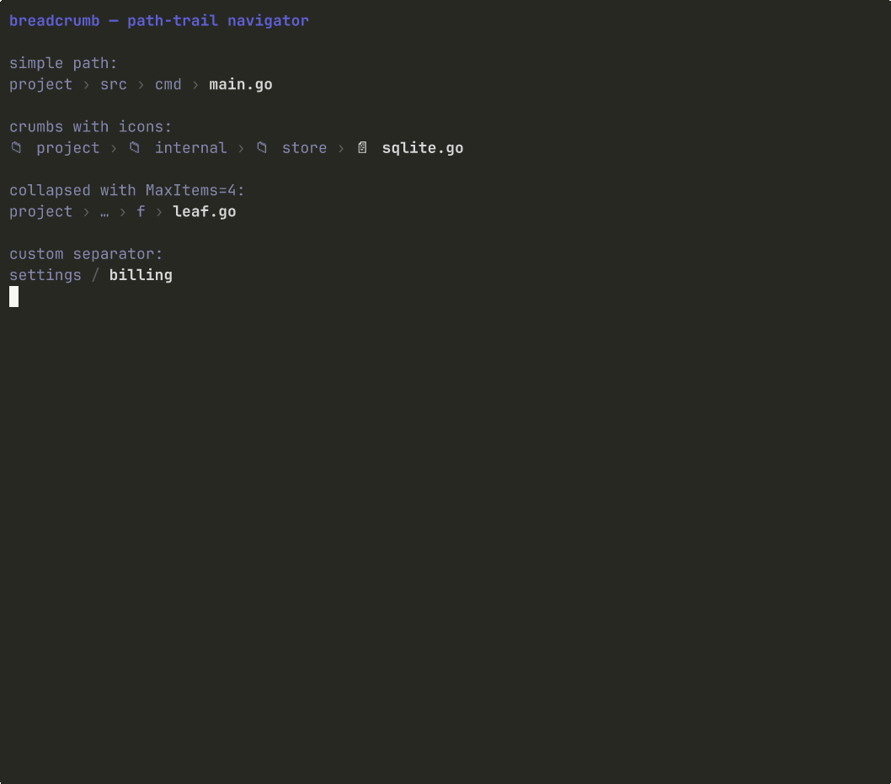

# Breadcrumb

> A path-style trail with custom separators, optional icons, and middle-collapse for long paths.



## Install

```bash
glyph add breadcrumb
```

This copies `breadcrumb.go` (and its test file) into your repo at the path your
`glyph.json` aliases declare. After install, the file is yours: edit it,
refactor it, rename it. There is no `breadcrumb` library to keep in sync.

## Hello, world

```go
package main

import (
	"fmt"

	"github.com/truffle-dev/glyph/components/breadcrumb"
)

func main() {
	fmt.Println(breadcrumb.RenderPath("project/src/cmd/main.go", breadcrumb.Options{}))
	fmt.Println(breadcrumb.Render([]breadcrumb.Crumb{
		{Icon: "📁", Label: "project"},
		{Icon: "📄", Label: "main.go"},
	}, breadcrumb.Options{}))
}
```

## API surface

Package: `breadcrumb`

**Types**

- `Crumb`
- `Options`
- `Style`

**Constants**

- `DefaultSeparator`

**Functions**

- `Render`
- `RenderPath`

## Dependencies

- glyph component `theme` (installed automatically)
- `github.com/charmbracelet/bubbletea@v1.3.10`
- `github.com/charmbracelet/lipgloss@v1.1.0`

## Notes

Stateless render. Build a `[]breadcrumb.Crumb` or call `RenderPath` with a
slash-joined string. The last crumb renders bold as the current location;
intermediate crumbs render muted. Set `Options.MaxItems` to cap a long trail
— the middle collapses into `…` while the root and the last few crumbs
remain visible.

Typical placement is the top of a navigator pane or a content surface that
needs to advertise the location: `project › src › cmd › main.go`.

## See also

- [examples/file-explorer](../../examples/file-explorer) — uses `breadcrumb` above the code preview
- [components/breadcrumb/story](./story) — runnable story binary (`go run -tags glyph_story ./components/breadcrumb/story/`)
- [registry manifest](./breadcrumb.json) — the JSON contract `glyph add` reads

## License

MIT, same as the rest of glyph.
