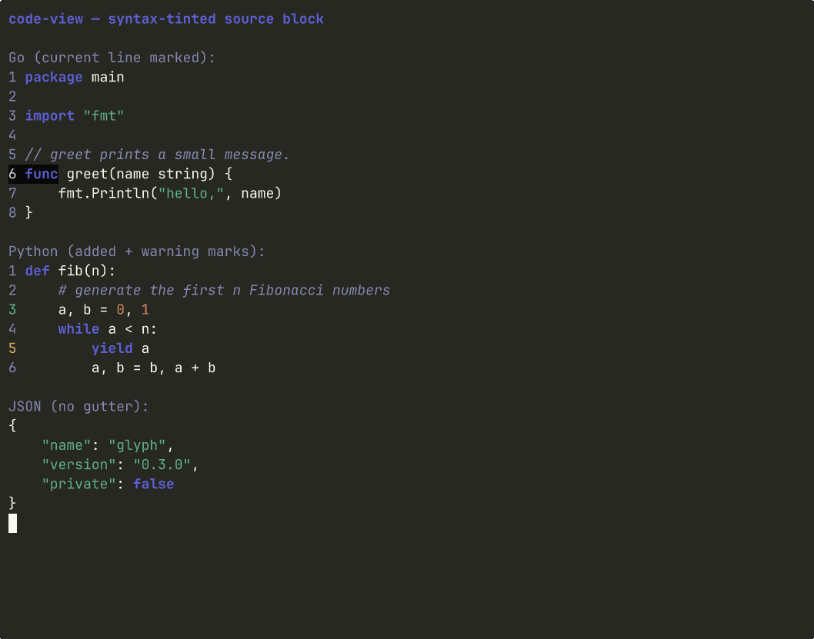

# Code view

> A syntax-tinted source-code block with optional line numbers and per-line marks.



## Install

```bash
glyph add code-view
```

This copies `code-view.go` (and its test file) into your repo at the path your
`glyph.json` aliases declare. After install, the file is yours: edit it,
refactor it, rename it. There is no `code-view` library to keep in sync.

## Hello, world

```go
package main

import (
	"fmt"

	codeview "github.com/truffle-dev/glyph/components/code-view"
)

func main() {
	src := `func main() {
    fmt.Println("hello, glyph")
}`
	fmt.Println(codeview.Render(codeview.Block{
		Source:     src,
		Language:   codeview.LangGo,
		ShowGutter: true,
		Marks:      map[int]codeview.LineMark{2: codeview.MarkHighlight},
	}))
}
```

## API surface

Package: `codeview`

**Types**

- `Block`
- `Language`
- `LineMark`

**Constants**

- `LangPlain`, `LangGo`, `LangJS`, `LangTS`, `LangPy`, `LangRust`, `LangJSON`, `LangBash`
- `MarkNone`, `MarkHighlight`, `MarkAdded`, `MarkRemoved`, `MarkWarning`, `MarkError`

**Functions**

- `Render`

## Dependencies

- glyph component `theme` (installed automatically)
- `github.com/charmbracelet/bubbletea@v1.3.10`
- `github.com/charmbracelet/lipgloss@v1.1.0`

## Notes

Stateless rendering primitive. Build a `codeview.Block` and pass it to `Render`.
The tokenizer is intentionally tiny — it tints keywords, double-quoted strings,
integer/float literals, and line comments for Go, JavaScript/TypeScript,
Python, Rust, JSON, and Bash. Production-quality highlighting belongs in a
separate component that wraps a real lexer like chroma or tree-sitter.

Use `Marks` to call out specific lines: `MarkHighlight` paints a focus row,
`MarkAdded`/`MarkRemoved` tint the gutter for diff hunks, `MarkError`
underlines a failing line. Set `MaxWidth` > 0 to truncate long lines with an
ellipsis so the block fits inside a fixed-width panel.

## See also

- [examples/file-explorer](../../examples/file-explorer) — uses `code-view` as the right pane
- [components/code-view/story](./story) — runnable story binary (`go run -tags glyph_story ./components/code-view/story/`)
- [registry manifest](./code-view.json) — the JSON contract `glyph add` reads

## License

MIT, same as the rest of glyph.
