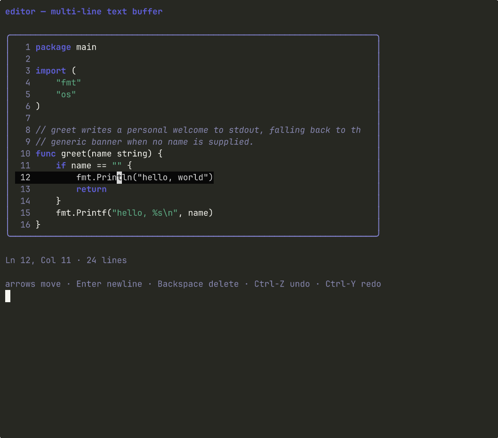

# Editor

> Editable multi-line text buffer with a 2D cursor, viewport scrolling, gutter, undo/redo, and per-line syntax tint.



The primitive a terminal-native code editor is built around. Pair it
with `file-tree` for the project sidebar, `tabs` for open buffers,
`status-bar` for the path and line indicator, and `find-bar` for
in-buffer search.

## Install

```bash
glyph add editor
```

`code-view` is pulled in as a dependency because the editor reuses its
tokenizer for non-cursor lines.

## Hello, world

```go
package main

import (
	"fmt"

	tea "github.com/charmbracelet/bubbletea"

	codeview "github.com/truffle-dev/glyph/components/code-view"
	"github.com/truffle-dev/glyph/components/editor"
	"github.com/truffle-dev/glyph/components/theme"
)

type model struct{ ed editor.Model }

func (m model) Init() tea.Cmd { return nil }
func (m model) Update(msg tea.Msg) (tea.Model, tea.Cmd) {
	if k, ok := msg.(tea.KeyMsg); ok && k.String() == "esc" {
		return m, tea.Quit
	}
	updated, cmd := m.ed.Update(msg)
	m.ed = updated
	return m, cmd
}
func (m model) View() string { return m.ed.View() }

func main() {
	ed := editor.New(theme.Default).
		WithContent("package main\n\nfunc main() {}").
		WithLanguage(codeview.LangGo).
		WithWidth(72).
		WithHeight(16)
	if _, err := tea.NewProgram(model{ed: ed}).Run(); err != nil {
		fmt.Println(err)
	}
}
```

## Bindings

```
←   →   ↑   ↓                cursor by one cell
Home / End                   line edges
Ctrl-Home / Ctrl-End         document edges
PgUp / PgDn                  one viewport-height
Enter                        split line at cursor
Backspace                    delete-back; join with prev line at col 0
Delete                       delete-forward; join with next line at EOL
Tab                          insert tabSize spaces (default 4)
Ctrl-Z                       undo
Ctrl-Y                       redo
```

## API surface

Package: `editor`

**Types**

- `Model` — Bubble Tea model
- `ChangeMsg{Value, Row, Col}` — emitted via `Cmd` on every edit

**Functions**

- `New`

**Model methods**

- `Init`, `Update`, `View`
- `WithContent`, `WithLanguage`, `WithWidth`, `WithHeight`, `WithGutter`, `WithTabSize`
- `Focus`, `Blur`, `Focused`
- `Value`, `Cursor`, `LineCount`, `Dirty`

## Dependencies

- glyph component `theme` (installed automatically)
- glyph component `code-view` (for the tokenizer)
- `github.com/charmbracelet/bubbletea@v1.3.10`
- `github.com/charmbracelet/lipgloss@v1.1.0`

## Notes

The buffer is `[][]rune` so every column index is a rune offset. The
cursor is a 2D `(row, col)` pair and never sits past the rune length of
its line. `ensureCursorVisible` runs after every key event and scrolls
`viewRow`/`viewCol` to keep the cursor on screen — vertical and
horizontal scroll fall out of the same mechanism.

Undo is inverse-op based: each edit pushes a single `op` describing how
to reverse it (insert ↔ delete, split ↔ join), so memory stays linear in
edit count and an undo is `O(line)` not `O(buffer)`. A fresh edit after
an undo clears the redo stack — the same shape every editor uses.

Syntax tinting reuses `codeview.Tokenize(line, lang)` per visible non-
cursor line. The cursor line is intentionally rendered as plain text so
the inverted cursor cell can be injected without parsing ANSI escapes.
This is also what most lightweight editors do during insert mode and
yields a clean focus cue without flicker.

## See also

- [components/code-view](../code-view) — read-only code block with the same tokenizer
- [components/editor/story](./story) — runnable story binary (`go run -tags glyph_story ./components/editor/story/`)
- [registry manifest](./editor.json) — the JSON contract `glyph add` reads

## License

MIT, same as the rest of glyph.
