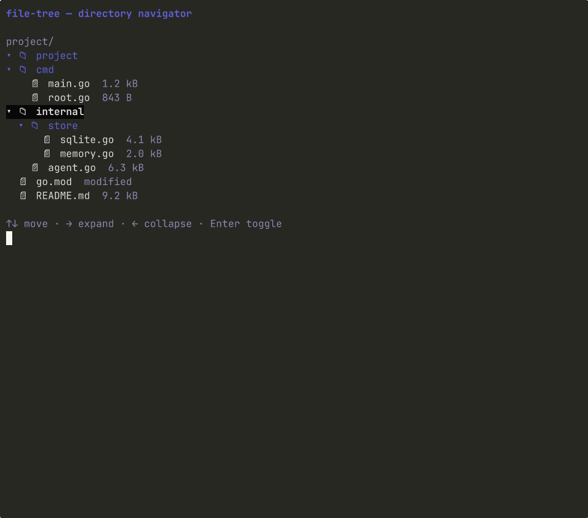

# File tree

> Interactive directory tree with expand/collapse, vim-style navigation, and multi-select.



## Install

```bash
glyph add file-tree
```

This copies `file-tree.go` (and its test file) into your repo at the path your
`glyph.json` aliases declare. After install, the file is yours: edit it,
refactor it, rename it. There is no `file-tree` library to keep in sync.

## Hello, world

```go
package main

import (
	"fmt"

	tea "github.com/charmbracelet/bubbletea"

	filetree "github.com/truffle-dev/glyph/components/file-tree"
)

type model struct{ t filetree.Model }

func (m model) Init() tea.Cmd { return nil }
func (m model) Update(msg tea.Msg) (tea.Model, tea.Cmd) {
	if k, ok := msg.(tea.KeyMsg); ok && k.String() == "q" {
		return m, tea.Quit
	}
	updated, cmd := m.t.Update(msg)
	m.t = updated
	return m, cmd
}
func (m model) View() string { return m.t.View() }

func main() {
	root := filetree.Node{
		Name: "src",
		Children: []filetree.Node{
			{Name: "main.go"},
			{Name: "internal", Children: []filetree.Node{
				{Name: "store.go"},
			}},
		},
	}
	if _, err := tea.NewProgram(model{t: filetree.New(root)}).Run(); err != nil {
		fmt.Println(err)
	}
}
```

## API surface

Package: `filetree`

**Types**

- `Node` — directory or leaf in the tree
- `Model` — Bubble Tea model
- `SelectMsg` — emitted on expand/collapse/leaf-Enter

**Functions**

- `New`

**Model methods**

- `Init`, `Update`, `View`
- `WithTitle`, `WithMultiSelect`
- `Selected`, `SelectedNode`, `IsSelected`, `SelectedPaths`
- `Expand`, `Collapse`, `SetCursor`

## Dependencies

- glyph component `theme` (installed automatically)
- `github.com/charmbracelet/bubbletea@v1.3.10`
- `github.com/charmbracelet/lipgloss@v1.1.0`

## Notes

The model holds a flat slice of visible rows that's rebuilt every time you
expand or collapse a directory. Bindings: ↑↓ or j/k for cursor, → or l to
expand a directory, ← or h to collapse-or-jump-to-parent, Enter to toggle a
directory or select a leaf, Space to toggle multi-select (when enabled
via `WithMultiSelect(true)`).

Wire `SelectMsg` into a parent Update to drive a sibling pane. The
[examples/file-explorer](../../examples/file-explorer) demo uses it to swap
the code preview when you navigate.

## See also

- [examples/file-explorer](../../examples/file-explorer) — full IDE-style surface using `file-tree`, `breadcrumb`, and `code-view`
- [components/file-tree/story](./story) — runnable story binary (`go run -tags glyph_story ./components/file-tree/story/`)
- [registry manifest](./file-tree.json) — the JSON contract `glyph add` reads

## License

MIT, same as the rest of glyph.
