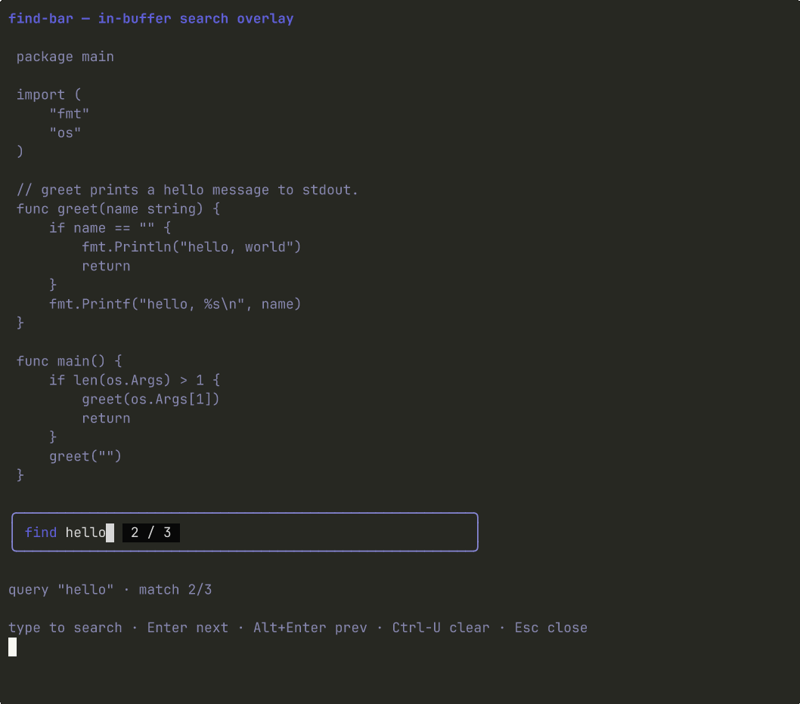

# Find Bar

> In-buffer search overlay: a narrow query input with a match counter, navigation messages, and a stateless `FindMatches` helper.



The bar is purely an input. It owns the query, the cursor, and the active
match index; the consumer owns the buffer and is the one that scrolls
to a hit. Pair with `editor` for `Ctrl-F` search inside a buffer, or
with any row-oriented component (`log-stream`, `markdown-viewer`) that
wants a search affordance.

## Install

```bash
glyph add find-bar
```

## Hello, world

```go
package main

import (
	"fmt"

	tea "github.com/charmbracelet/bubbletea"

	findbar "github.com/truffle-dev/glyph/components/find-bar"
	"github.com/truffle-dev/glyph/components/theme"
)

var lines = []string{"hello world", "world hello", "WORLD"}

type model struct{ bar findbar.Bar }

func (m model) Init() tea.Cmd { return nil }
func (m model) Update(msg tea.Msg) (tea.Model, tea.Cmd) {
	switch msg := msg.(type) {
	case findbar.QueryMsg:
		matches := findbar.FindMatches(lines, msg.Value, m.bar.CaseSensitive())
		m.bar = m.bar.WithMatches(matches, 0)
		return m, nil
	case findbar.CloseMsg:
		return m, tea.Quit
	}
	updated, cmd := m.bar.Update(msg)
	m.bar = updated
	return m, cmd
}
func (m model) View() string { return m.bar.View() }

func main() {
	m := model{bar: findbar.New(theme.Default).WithWidth(56)}
	if _, err := tea.NewProgram(m).Run(); err != nil {
		fmt.Println(err)
	}
}
```

## Bindings

```
typing                       insert into query (emits QueryMsg)
←   →                        cursor by one rune
Home / End                   query edges
Backspace                    delete-back (emits QueryMsg)
Delete                       delete-forward (emits QueryMsg)
Ctrl-U                       clear query (emits QueryMsg "")
Enter                        emit NextMsg
Alt-Enter / F3 with Alt      emit PrevMsg
F3                           emit NextMsg
Esc                          emit CloseMsg
```

## API surface

Package: `findbar`

**Types**

- `Bar` — Bubble Tea model
- `Match{Row, ColStart, ColEnd}` — one buffer hit (rune indices)
- `QueryMsg{Value}`, `NextMsg`, `PrevMsg`, `CloseMsg`

**Functions**

- `New`
- `FindMatches(lines, query, caseSensitive) []Match` — stateless helper

**Model methods**

- `Init`, `Update`, `View`
- `WithWidth`, `WithQuery`, `WithCaseSensitive`, `WithMatches`
- `Focus`, `Blur`, `Focused`
- `Query`, `CaseSensitive`, `Current`, `MatchCount`, `CurrentMatch`

## Dependencies

- glyph component `theme` (installed automatically)
- `github.com/charmbracelet/bubbletea@v1.3.10`
- `github.com/charmbracelet/lipgloss@v1.1.0`

## Notes

The bar emits messages via `Cmd` rather than mutating any parent state.
The consumer subscribes by intercepting the four message types in its
own `Update`: re-run `FindMatches` on `QueryMsg`, advance/retreat the
active match index on `Next`/`Prev`, dismiss the overlay on `Close`.
This is what every editor does at the boundary between an input widget
and the buffer it searches.

`FindMatches` walks lines for plain substring hits and returns matches
in document order. Empty queries return `nil`. Non-overlapping by
construction: a 2-char query in `aaaa` produces 2 matches at columns
0..2 and 2..4, not 3. If you want fuzzy or regex behavior, wire your
own search and pass the resulting `[]Match` to `WithMatches`.

## See also

- [components/editor](../editor) — pairs naturally as the search target
- [components/find-bar/story](./story) — runnable story binary
  (`go run -tags glyph_story ./components/find-bar/story/`)
- [registry manifest](./find-bar.json) — the JSON contract `glyph add` reads

## License

MIT, same as the rest of glyph.
