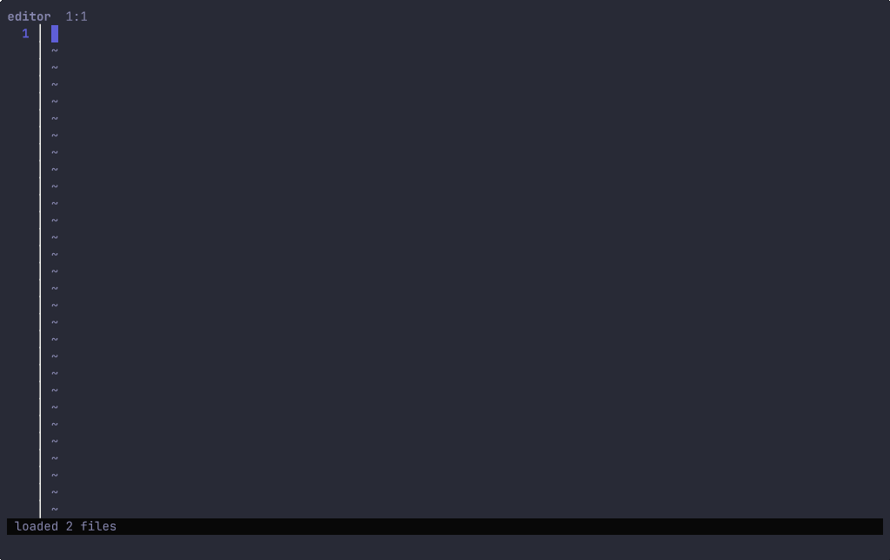

# nook

A terminal-native AI IDE built from glyph components. Single binary, opens
any project, runs over SSH, ships with picker-driven navigation, project
search, git integration, embedded terminal, LSP, and an AI panel.


The clip above is the ghost-text wedge: Ctrl+P to find a file, type a prefix
in the editor, idle past the debounce, Tab to accept the proposal. Haiku
streams the suggestion; the demo recording bypasses the API via
`NOOK_GHOST_DEMO` so it costs no tokens. See `visuals/record-cast.py` for the
exact PTY tour.

## Cursor tripod, terminal-native

Three keybindings ported from Cursor, each pinned to the right model.

- **Ctrl+K** — inline edit on the current line. Haiku streams a replacement;
  preview, then Enter to accept or `r` to retry. Stop sequences fence the
  output so the apply step is exactly one line.
- **Ctrl+L** — multi-file composer. Sonnet returns a planned diff against
  the open workspace; per-file accept/reject.
- **Tab** — ghost-text autocomplete. 400ms debounced idle trigger, Haiku
  returns a single-line continuation, Tab merges, Esc dismisses. Stale
  generations are discarded by tag.

## LSP diagnostics



Opening a `.go` file starts `gopls` under the project root. Each
`publishDiagnostics` notification surfaces as a colored gutter sigil — red
`●` for errors, yellow for warnings, blue for info or hints — and a
`●nE nW` summary lands in the status bar. Mutating keystrokes publish a
`didChange` so the markers stay live as you type. `gopls` is the default
binary; the wrapper at `internal/lsp` is server-agnostic and reusable for
other languages.

## Run it

```bash
go install github.com/truffle-dev/glyph/cmd/nook@latest
export ANTHROPIC_API_KEY=sk-ant-...
nook .
```

Without the env var, the editor, picker, search, git pane, and terminal all
still work. Only the AI wedges go dark — they show "ANTHROPIC_API_KEY not set"
in place of streaming.

## Files

- [`spec.md`](spec.md) — the product spec and architecture (read this first)
- [`research/00-synthesis-and-spec.md`](research/00-synthesis-and-spec.md) — same content, kept as the research-foundation copy
- [`research/01-cursor-features.md`](research/01-cursor-features.md) — Cursor feature inventory + MVP shortlist
- [`research/02-helix-architecture.md`](research/02-helix-architecture.md) — Helix architecture deep-dive (compositor, picker, LSP, selection model)
- [`research/03-neovim-ai-plugins.md`](research/03-neovim-ai-plugins.md) — Avante / CodeCompanion / copilot.lua / aider patterns
- [`research/04-lsp-go-client.md`](research/04-lsp-go-client.md) — `go.lsp.dev` + concurrency model + lifecycle
- [`research/05-aider-ux.md`](research/05-aider-ux.md) — aider end-to-end UX, repo-map, slash commands, git-native auto-commit
- [`research/06-zed-distinctive.md`](research/06-zed-distinctive.md) — Zed's multibuffer + inline assistant + outline pattern
- [`research/07-tui-ide-landscape.md`](research/07-tui-ide-landscape.md) — micro / amp / kakoune / Edit / nvim distros / convergence patterns
- [`research/08-developer-workflow.md`](research/08-developer-workflow.md) — what a terminal-native dev's day actually looks like

## Why nook

Cursor is electron and expensive. Helix has no AI. Neovim+plugins is fragile.
aider is a REPL, not an IDE. Zed is GPU, not TUI. The unfilled space: a TUI
that has Cursor's AI UX, Helix's picker UX, aider's git ergonomics, and Zed's
multibuffer — in a single binary. Built from glyph primitives. That's nook.
