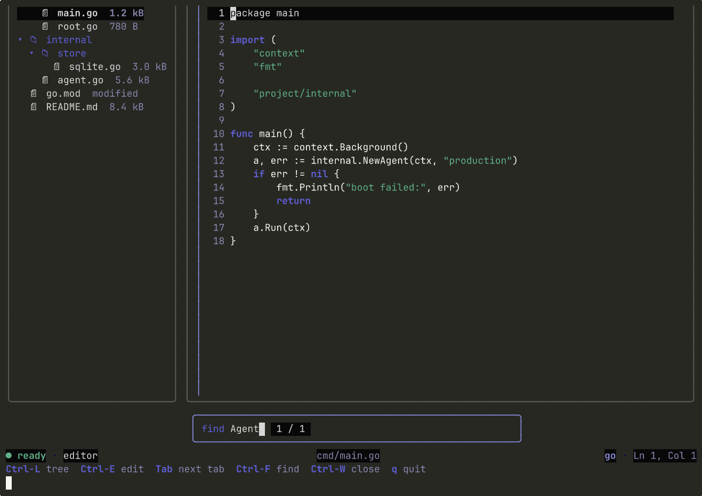

# code-editor

> A working terminal-native code editor composed from eight glyph components.



This is the proto-IDE end-to-end demo. File tree on the left, tab row
above an editable buffer on the right, find-bar overlay you can pop
with `Ctrl-F`, status-bar with the path and line indicator, key-hints
pinned to the bottom. Every editor on the planet — Cursor, VS Code,
Sublime, vim — is a variation on this layout. Once the glyph
components below render the layout, they render every editor.

## Composition

```
┌──────── files ────────┐ ┌──────── editor ──────────────────────┐
│ ▾ project             │ │  main.go · root.go · agent.go        │
│  ▾ cmd                │ │ ────────────────────────────────     │
│    main.go            │ │  1 package main                      │
│    root.go            │ │  2                                   │
│  ▾ internal           │ │  3 import (                          │
│    ▾ store            │ │  4   "context"                       │
│      sqlite.go        │ │ ...                                  │
│    agent.go           │ │                                      │
│  go.mod               │ │                                      │
│  README.md            │ │                                      │
└───────────────────────┘ └──────────────────────────────────────┘
                          ┌─ find Agent  1 / 1 ──────────┐
                          └──────────────────────────────┘
● ready · editor             cmd/main.go             go · Ln 1, Col 1
Ctrl-L tree  Ctrl-E edit  Tab next tab  Ctrl-F find  Ctrl-W close  q quit
```

Eight components in play:

- `file-tree` — the project sidebar
- `panel` — the bordered frames around each pane
- `tabs` — the row of open files
- `editor` — the editable buffer (gutter, undo, syntax tint)
- `find-bar` — the search overlay
- `status-bar` — `● ready · editor` + path + language + Ln/Col
- `key-hints` — the bottom bar of bindings
- `code-view` — reused by the editor's tokenizer for non-cursor lines

## Run

```bash
go run ./examples/code-editor
```

## Bindings

```
↑ ↓ ← →              focused panel cursor motion
Enter                on a tree leaf, open the file in a tab
Tab / Shift-Tab      cycle open tabs (when not in find-bar)
Ctrl-L               focus the file tree
Ctrl-E               focus the editor
Ctrl-F               open the find-bar
Esc                  close the find-bar
Ctrl-W               close the active tab (never closes the last one)
Ctrl-Z / Ctrl-Y      undo / redo (forwarded to the editor)
q / Ctrl-C           quit
```

## Notes

The fixture is in-memory: `seedFiles()` returns six Go/JSON/Markdown
files, `seedTree()` matches that with a small project tree. No backing
filesystem; the example is a single binary you can drop on any box and
run.

Each open file becomes one `editor.Model` instance plus an `openBuffer`
wrapper that owns the path and language. The tab label flips to
`• main.go` when the buffer is dirty. Closing a tab refuses to close
the last one — there's always one buffer open.

The find-bar is purely an input. When the user types into it, the host
model (this file) is the one that walks the active buffer with
`findbar.FindMatches(lines, query, caseSensitive)` and reseats the bar
via `WithMatches`. `NextMsg` / `PrevMsg` advance the active match
index; the host could also scroll the editor to the match (a future
enhancement — currently the bar reports the match but the editor's
cursor stays put).

## See also

- [components/editor](../../components/editor) — the buffer primitive
- [components/find-bar](../../components/find-bar) — the search overlay
- [components/file-tree](../../components/file-tree) — the sidebar
- [components/tabs](../../components/tabs) — the tab row
- [examples/file-explorer](../file-explorer) — read-only cousin of this demo

## License

MIT, same as the rest of glyph.
